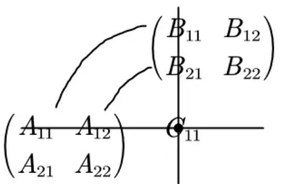
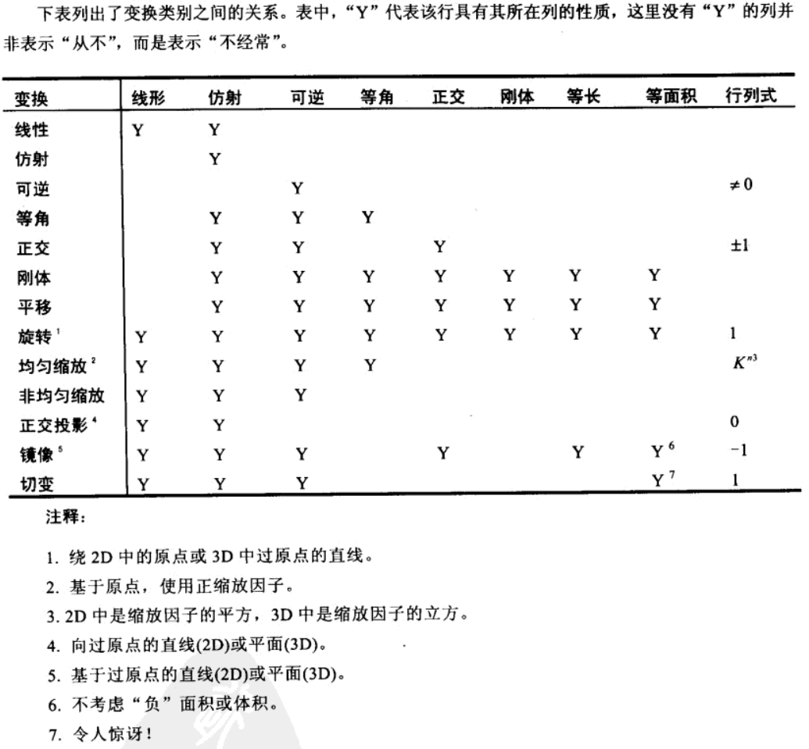
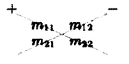
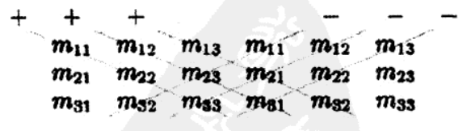

# 3D math  

> 3D数学是一门和计算几何相关的学科，计算几何是研究用数值方法解决几何问题的学科，这两门学科广泛应用于使用计算机模拟3D世界的领域，如图形学、游戏、仿真、机器人、VR、动画等。  
> ——《3D数学基础：图形与游戏开发》

- [x] [笛卡尔坐标系统](#笛卡尔坐标系统)  
- [x] [多坐标系](#多坐标系)  
- [x] [向量](#向量)  
- [x] [向量运算](#向量运算)  
- [x] [3D向量类](#3d向量类)
- [x] [矩阵](#矩阵)
- [x] [矩阵和线性变换](#矩阵和线性变换)
- [x] [矩阵Plus（行列式、矩阵的逆、正交矩阵、4x4齐次矩阵）](#矩阵plus)
- [ ] 3D中的方位与角位移  
- [ ] 几何图元  
- [ ] 几何检测  
- [ ] 三角网格
- [ ] 图形数学
- [ ] 可见性检测

## 笛卡尔坐标系统  

左右手坐标系有所不同，在研究问题时这点要注意一下，这里无特殊说明都使用**左手坐标系**  
  

## 多坐标系  

- 世界坐标系  
- 物体坐标系  
- 摄像机坐标系  
- 惯性坐标系  

每种坐标系都应该用在合适的地方，如描述物体的位置应该**世界坐标系**，检查两个物体间相对位置、是否应该有相互作用应该使用**物体坐标系**；**摄像机坐标系**是为观察者服务的，它用来控制屏幕上的显示区域；**惯性坐标系**是为了简化世界坐标系和物体坐标系之间的转化而被创建的，它的原点和物体坐标系重合，但它的轴完全平行于世界坐标系的轴  

由此引入一个很重要的概念：**嵌套坐标系**。比如要求一只羊耳朵在空间中的运动轨迹。我们假设它只会上下摆动，这轨迹仅用世界坐标系也难以描述，我们可以从羊的运动带动头再带动耳朵去分析，羊的运动相对于世界坐标系很容易就能得出运动轨迹，羊头和羊的运动除了y轴不一样外几乎是一致的，耳朵也是如此，和羊头一致，这样耳朵相对于羊头，羊头相对于羊，羊相对于世界的运动可以通过**线性变换**计算出来，“相对于”说的就是子坐标系相对于父坐标系  

**描述坐标系**就是描述坐标系的位置和方向。坐标系的位置指原点的位置，这里指的是其在父坐标系中的位置，坐标系方向指轴的方向，用向量表示，这点比较复杂，以后再说  

在世界中，物体之间的交互要通过**坐标变换**完成。它可以这么解释：知道某一点的坐标，怎样在另一个坐标系中描述该点。我们知道可以使用**惯性坐标系**这个媒介，用**旋转**可以从物体坐标系转换到惯性坐标系，用**平移**可以从惯性坐标系转换到世界坐标系  

## 向量  

“点”描述位置，“向量”描述位移和相对位置，它同时包含了方向和数量大小，向量 $[x,y]$ 描述了原点到点 $(x, y)$ 的位移量  
思考位置时，想像一个点，思考位移时，想像一个向量和一个箭头  

## 向量运算  

**负向量(各分量取负)**：
$\vec v+(-\vec v)=0$
，几何上表示与原点的连线方向相反  

**向量的模**：
$||\vec v||=\sqrt{v_1^2+v_2^2+...+v_{n-1}^2+v_n^2}$  

**标量与向量可以相乘**：  

$$
k\begin{bmatrix}
  x \\
  y \\
  z
\end{bmatrix}=
\begin{bmatrix}
  x \\
  y \\
  z
\end{bmatrix}k=
\begin{bmatrix}
  kx \\
  ky \\
  kz
\end{bmatrix}
$$  

几何意义上标量与向量相乘是对向量进行缩放以及翻转操作，拉伸、缩短、反转方向（各分量取负值）  

**标准化向量**：很多时候我们只关心向量的方向而不在乎其大小，那么使用**单位向量**更加方便，单位向量就是大小为1的向量，它也经常被简单的称为**标准化向量**或更简单地称为**法线**  

**向量标准化：向量除以它的模**  
$\vec v_{norm}=\dfrac{\vec v}{||\vec v||}$  

两个**维数相同**的向量可以相加/相减：各分量相加减  

$$
\begin{bmatrix}
  x_1 \\
  y_1 \\
  z_1
\end{bmatrix}+
\begin{bmatrix}
  x_2 \\
  y_2 \\
  z_2
\end{bmatrix}=
\begin{bmatrix}
  x_1+x_2 \\
  y_1+y_2 \\
  z_1+z_2
\end{bmatrix}
$$  

向量相减解释为一个向量加上另一个向量的负向量：
$\vec v_1-\vec v_2=\vec v_1+(-\vec v_2)$  
向量加法满足交换律，减法不满足交换律，因为
$\vec a-\vec b=-(\vec b-\vec a)$
这两个向量的方向是相反的  

向量加减法的三角形法则：
$\vec a+\vec b$
是一条b尾平移至a头，然后a尾指向b头的向量；
$\vec a-\vec b$
是一条b尾平移至a尾，然后b头指向a头的向量  

**两点之间的位移**是非常普遍的需求，利用三角形法则就能很容易解出来，只要把原点到两点的直线段当做两个向量，然后相减就可以了

**距离公式**：计算两点之间的距离  
我们可以先用减法得到两点间的位移向量，然后取模就能得到距离大小，由此得到两点间的距离公式为  
$(\vec a, \vec b)=||\vec b-\vec a||=\sqrt{(b_x-a_x)^2+(b_y-a_y)^2+(b_z-a_z)^2}$  

**向量点乘**：对应分量乘积的和，结果是一个标量，点乘满足交换律  

$$
\vec a\cdot\vec b=
\begin{bmatrix}
  a_1 \\
  a_2 \\
  a_3
\end{bmatrix}\cdot
\begin{bmatrix}
  b_1 \\
  b_2 \\
  b_3
\end{bmatrix}=
\begin{bmatrix}
  a_1b_1 \\
  a_2b_2 \\
  a_3b_3
\end{bmatrix}=
\sum\limits_{i=1}^{n}a_ib_i
$$  

点乘描述了两个向量的**相似程度**，点乘结果越大，向量越相近  
点乘也等于向量大小和向量夹角cos的积：
$\vec a·\vec b=||\vec a||\ ||\vec b||\ cos\theta$  
从中可以解出：
$\theta=\arccos{(\dfrac{\vec a\cdot\vec b}{||\vec a||\ ||\vec b||})}$  

根据点乘结果也可以大致判断向量的方向  
  

**向量投影**：给定两个向量 $\vec v$ 和 $\vec n$ ，能将 $\vec v$ 分解成两个分量 $\vec v_\parallel$ 和 $\vec v_\perp$，他俩一个平行于 $\vec n$，一个垂直于 $\vec n$，一般称平行分量 $\vec v_\parallel$ 为 $\vec v$ 在 $\vec n$ 上的投影  
根据上面的点乘公式可以求出：
$\vec v_\parallel=\vec n\dfrac{\vec v\cdot\vec n}{||\vec n||^2}$  
根据公式 $\vec v_\parallel+\vec v_\perp=\vec v$，可知：
$\vec v_\perp=\vec v-\vec v_\parallel=\vec v-\vec n\dfrac{\vec v·\vec n}{||\vec n||^2}$  

注意：后面推导公式的时候（原书中）会写$v$在$n$上的平行分量为$(v \cdot n)n$，是因为那时候我们只关心$n$的方向，它的模长默认为1

**向量叉乘：**

$$
\begin{bmatrix}
  x_1 \\
  y_1 \\
  z_1
\end{bmatrix}\times
\begin{bmatrix}
  x_2 \\
  y_2 \\
  z_2
\end{bmatrix}=
\begin{bmatrix}
  y_1z_2-z_1y_2 \\
  z_1x_2-x_1z_2 \\
  x_1y_2-y_1x_2
\end{bmatrix}
$$  

它的结果是一个向量，它垂直于原来的两个向量  

叉乘不满足交换律，满足反交换律：
$\mathbf{a}\times\mathbf{b}=-(\mathbf{b}\times\mathbf{a})$，和点乘在一起运算时优先运算叉乘（三重积：
$\mathbf{a}\cdot\mathbf{b}\times\mathbf{c}$ 是个标量）  
它的长度为：
$||\mathbf{a}\times\mathbf{b}||=||\mathbf{a}||\ ||\mathbf{b}||\sin\theta$  
叉乘的长度与向量夹角的sin值有关，这个长度的数量大小也是**a为边b为底的平行四边形的面积，$||a||\sin\theta$为平行四边形的高**  
叉乘得到的向量方向判断（计算机倒是不需要这样），将向量 $\mathbf{a}\times\mathbf{b}$ 如下图相连  
  
在[左手坐标系](#笛卡尔坐标系统)中如果是顺时针方向，那么叉乘结果指向自己，如果是逆时针方向那么远离自己  
在右手坐标系中则相反  

注：点乘尾-尾相连求夹角，叉乘头-尾相连求方向  

## 3D向量类  

3D向量存储着xyz分量，3D向量类所需要的基本操作有  

- 存取向量的各个分量(xyz)  
- 向量间的赋值操作  
- 比较两向量是否相同  

我们也应该支持基本的向量运算  

- 将向量置为零向量  
- 向量求负  
- 求向量的模  
- 向量与标量的乘除法  
- 向量标准化  
- 向量加减法  
- 计算两点（用向量表示）间的距离  
- 向量点乘  
- 向量叉乘  

## 矩阵  

矩阵是重要的基础，它通过定义一种运算而将一个坐标系中的向量转换到另一个坐标系中  

m行n列的矩阵记作 $m \times n$ 矩阵，一般用一个大写字母记一个矩阵，比如：矩阵 **$M$**  

行数和列数相同的矩阵称作**方阵**，下面主要讨论 $2\times2、3\times3、4\times4$ 方阵  

所有的非对角元素都为0的**方阵**叫做**对角矩阵**  

**单位矩阵**是主对角元素都为1，其余元素都为0的矩阵，它是矩阵的**乘法单位元**，n维单位矩阵记作$I_n$  

在混用矩阵和向量的时候要特别注意**向量是行向量还是列向量**，毕竟向量本身用一行或者一列的方式表示并没有本质上的不同  

**矩阵转置**：  

$r \times c$ 矩阵 $M$，它的转置矩阵为 **$M^r$**，是一个 $c \times r$ 矩阵  

矩阵转置会使行变成列，列变成行，对于方阵和沿着主对角线翻折得到的矩阵相同  

- 行向量 <--转置--> 列向量  
- 书面中的列向量通常记作 $[a, b, c]^r$  
- 任意矩阵 $M=(M^r)^r$，矩阵转置的转置为原矩阵，也适用于向量
- 任意对角矩阵$D$，$D^r=D$

**标量和矩阵的乘法**：  

$kM$即$k$和矩阵$M$中的每一个元素相乘  

**矩阵乘法**：

一个$r \times n$矩阵$A$能和一个$n \times c$矩阵$B$相乘，记作$AB$，它是一个$r \times c$矩阵，$A$的列数和$B$的行数必须相等  

$\vec c_{ij} =\sum\limits_{k=1}^{n}a_{ik}b_{kj}$  
矩阵a中每一行与b中每一列的乘积之和能得到c中一个元素（相应行列向量的点积），位置是一一对应的  

  

- $I$是单位矩阵，那么$MI=IM=M$  
- 矩阵乘法不满足交换律，$AB \neq BA$  
- 矩阵乘法满足结合律，$ABC = A(BC)$，这里有个矩阵链问题，即寻找标量乘法最少的括号问题  
- 矩阵乘法满足标量或向量的结合律，$(kA)B=k(AB)=A(kB)$，$vAB=v(AB)$  
- **矩阵积的转置等于先转置矩阵再相乘**，$(AB)^r=B^rA^r$，这个同样可以扩展到多个矩阵的情况  

注意：矩阵乘法一定要有意义上面说的才能成立，有意义即两个矩阵能够相乘  

**向量与矩阵的乘法**：

向量可以作为一行n列的矩阵或者一列n行的矩阵，运算同样满足矩阵乘法  

- 行向量左乘矩阵得到行向量，列向量右乘矩阵得到列向量，方向不能换  
- 结果向量中的每个元素都是原向量与矩阵中单独行或列的点积  
- 矩阵中的每个元素都决定了向量中特定元素在输出向量中的比重  
- 矩阵和向量的乘法满足对向量加法的分配率，$(v+w)M=vM+wM$  

**行向量与列向量**：  

行向量/列向量和$M$的乘积为  

$$
[xm_{11}+ym_{21}+zm_{31}, xm_{12}+ym_{22}+zm_{32}, xm_{13}+ym_{23}+zm_{33}]
$$  

$$
\begin{bmatrix}
  xm_{11}+ym_{12}+zm_{13} \\
  xm_{21}+ym_{22}+zm_{23} \\
  xm_{31}+ym_{32}+zm_{33}
\end{bmatrix}
$$

这两个结果中各分量的值完全不同，这就是行向量和列向量区别如此重要的原因  

用矩阵乘法转换坐标系的时候，使用行向量是非常直观的，转换从左往右依次发生，而且，DirectX使用的是行向量  

而使用列向量稍微有点别扭，从右往左发生转换，很多图形学的书里面用的都是列向量，OpenGL用的也是列向量  

所以**在看资料或者开源代码的时候，一定要区分它们使用的是行向量还是列向量**  

3D数学编程中，形式转换经常会出错，后面会设计矩阵类，会好一点，这方面还是要多多注意啊  

### 矩阵-几何解释  

一般而言，方阵能描述任意的线性变换，线性变换保留直线的同时，其他的几何性质可能都会发生改变（长度、角度、面积和体积），直观点说，线性变换可能“拉伸”坐标系，但不会“弯曲”或“卷曲”坐标系，下面是一组非常有用的变换  

- 旋转  
- 缩放  
- 投影  
- 镜像  
- 仿射（包含平移的变换）  

这里有点图形学的味道了  

**矩阵变换向量**：

把矩阵的行为解释为坐标系的基向量，那么乘以该矩阵就相当于执行了一次坐标转换，若有$aM=b$，我们就可以说$M$将$a$转换到了$b$  

从这一点上看，术语“转换”和“乘法”是等价的  

$$
v=
\begin{bmatrix}
  x \\
  y \\
  z
\end{bmatrix}=
x
\begin{bmatrix}
  1 \\
  0 \\
  0
\end{bmatrix}+
y
\begin{bmatrix}
  0 \\
  1 \\
  0
\end{bmatrix}+
z
\begin{bmatrix}
  0 \\
  0 \\
  1
\end{bmatrix}=
xp+yq+zr
$$

$p,q,r$作为基向量，$v$被表示为它们的线性变换，以$p,q,r$为行构建矩阵$M$，实际上任意三个线性无关的向量都能作为基向量  

> 线性相关和线性无关是线性代数中的概念。一组向量被称为线性相关，当且仅当其中至少有一个向量可以表示为其他向量的线性组合。换句话说，如果存在一组不全为零的系数，使得这些系数与对应的向量相乘再相加等于零向量，那么这组向量就是线性相关的。  
> 相反，如果一组向量中没有任何一个向量可以表示为其他向量的线性组合，那么这组向量就被称为线性无关。也就是说，只有当所有系数都为零时，这些系数与对应的向量相乘再相加才能等于零向量。  
> 举个例子，设有两个向量 v 和 w。如果存在一个标量 k 使得 v=kw，那么这两个向量就是线性相关的。否则，它们就是线性无关的。

**矩阵的形式**：

看看前面用到的基向量乘以任意矩阵的效果  

$$
[1\ 0\ 0]
\begin{bmatrix}
  m_{11}\ m_{12}\ m_{13} \\
  m_{21}\ m_{22}\ m_{23} \\
  m_{31}\ m_{32}\ m_{33}
\end{bmatrix}=
[m_{11}\ m_{12}\ m_{13}]
$$  

$$
[1\ 2\ 0]
\begin{bmatrix}
  m_{11}\ m_{12}\ m_{13} \\
  m_{21}\ m_{22}\ m_{23} \\
  m_{31}\ m_{32}\ m_{33}
\end{bmatrix}=
[m_{21}\ m_{22}\ m_{23}]
$$  

$$
[1\ 0\ 0]
\begin{bmatrix}
  m_{11}\ m_{12}\ m_{13} \\
  m_{21}\ m_{22}\ m_{23} \\
  m_{31}\ m_{32}\ m_{33}
\end{bmatrix}=
[m_{31}\ m_{32}\ m_{33}]
$$  

**矩阵的每一行都能解释为转换后的基向量**，这个概念有两条重要性质  

- 有了一种简单的方法形象化解释矩阵所代表的的变换  
- 有了反向建立矩阵的可能--给出一个期望的变换（旋转、缩放等等），能够构造一个变换矩阵代表次变换  

可以通过想象变换后的坐标系的基向量来想象矩阵。这些基向量在 2D 中构成“L”型，在3D中构成“三角架”型。用一个盒子及辅助物更有助于理解。  

## 矩阵和线性变换  

这一章涉及到很多公式推导，我在文章里面都没有写推导过程，要注意涉及到“任意（轴/方向）”的推导使用的向量$n$，它的默认模长为1  

**变换物体或坐标系**都能达到我们要的效果，将物体变换一个量相当于以相反的量变换描述这个物体的坐标系，当有多个变换时要从最后的变换往前依次以相反的量变换，例如将物体旋转20度，然后放大2倍，等价于将坐标系缩小两倍，然后旋转-20度  

### 旋转  

**2D**中的旋转只能绕着某个点旋转，那个点称为**锚点**，下面假设锚点就是原点。2D中旋转只有一个参数：**角度$\theta$**，它描述了旋转量。通常逆时针旋转作为旋转的正方向，顺时针作为负方向  

基向量$p,q$绕原点旋转，得到新的基向量$p', q'$的形式构造矩阵如下  

$$
R(\theta)=
\begin{bmatrix}
  p' \\
  q'
\end{bmatrix}=
\begin{bmatrix}
  \cos(\theta) & \sin(\theta) \\
  -\sin(\theta) &  \cos(\theta)
\end{bmatrix}
$$  

**3D**中的旋转是绕轴旋转，左右手呈点赞的手势，大拇指的朝向是轴的正方向，手往胸口那里旋转为正方向  

绕 **$x$轴** 旋转的变换矩阵

$$
R(\theta)=
\begin{bmatrix}
  p' \\
  q' \\
  r'
\end{bmatrix}=
\begin{bmatrix}
  1 & 0 & 0 \\
  0 & cos(\theta) & \sin(\theta) \\
  0 & -\sin(\theta) & \cos(\theta)
\end{bmatrix}
$$  

绕 **$y$轴** 旋转的变换矩阵

$$
R(\theta)=
\begin{bmatrix}
  p' \\
  q' \\
  r'
\end{bmatrix}=
\begin{bmatrix}
  cos(\theta) & 0 & -\sin(\theta) \\
  0 & 1 & 0 \\
  \sin(\theta) & 0 & \cos(\theta)
\end{bmatrix}
$$  

绕 **$z$轴** 旋转的变换矩阵

$$
R(\theta)=
\begin{bmatrix}
  p' \\
  q' \\
  r'
\end{bmatrix}=
\begin{bmatrix}
  cos(\theta) & \sin(\theta) & 0\\
  -\sin(\theta) & \cos(\theta) & 0\\
  0 & 0 & 1
\end{bmatrix}
$$  

时刻记住每一维（行）都是新的基向量，由原基向量[1 0 0]、[0 1 0]和[0 0 1]变换而来  

绕 **任意轴n** 旋转的变换矩阵  

$$
R(n,\theta)=
\begin{bmatrix}
  p' \\
  q' \\
  r'
\end{bmatrix}=
\begin{bmatrix}
  n^2_{x}(1-\cos\theta)+\cos\theta & n_{x}n_{y}(1-cos\theta)+n_{z}\sin\theta & n_{x}n_{z}(1-cos\theta)-n_{y}\sin\theta\\
  n_{x}n_{y}(1-cos\theta)-n_{z}\sin\theta & n^2_{y}(1-\cos\theta)+\cos\theta & n_{y}n_{z}(1-cos\theta)+n_{x}\sin\theta\\
  n_{x}n_{z}(1-cos\theta)+n_{y}\sin\theta & n_{y}n_{z}(1-cos\theta)-n_{x}\sin\theta & n^2_{z}(1-\cos\theta)+\cos\theta
\end{bmatrix}
$$  

### 缩放  

均匀缩放：在各方向应用相同比例因子$k$缩放物体，长度的比例因子为$k$，面积为$k^2$，体积为$k^3$  

非均匀缩放：在不同方向应用不同比例因子缩放物体，以达到“拉伸”或“挤压”物体的效果；非均匀缩放和切变的效果很像  

如果$|k|<1$，物体将“变短”，$|k|>1$物体“变长”，$k=0$就是正交投影  

**沿坐标轴缩放**：  

拿2D举例，缩放因子为$k_x$和$k_y$，那么  

$$
p'=k_xp=k_x[1 \ 0]=[k_x \ 0] \\
q'=k_yq=k_y[0 \ 1]=[0 \ k_y]
$$  

由此可见**2D**缩放变换矩阵为  

$$
S(k_x, k_y)=
\begin{bmatrix}
  p' \\
  q'
\end{bmatrix}=
\begin{bmatrix}
  k_x & 0 \\
  0 & k_y
\end{bmatrix}
$$  

**3D**中的缩放变换矩阵为  

$$
S(k_x, k_y， k_z)=
\begin{bmatrix}
  p' \\
  q' \\
  r'
\end{bmatrix}=
\begin{bmatrix}
  k_x & 0 & 0 \\
  0 & k_y & 0 \\
  0 & 0 & k_z
\end{bmatrix}
$$  

**沿任意方向缩放**：($n$为缩放方向，$k$为缩放因子)  

**2D**中  

$$
S(n, k)=
\begin{bmatrix}
  p' \\
  q'
\end{bmatrix}=
\begin{bmatrix}
  1+(k-1)n^2_x & (k-1)n_xn_y \\
  (k-1)n_xn_y & 1+(k-1)n^2_y
\end{bmatrix}
$$  

**3D**中

$$
S(n, k)=
\begin{bmatrix}
  p' \\
  q' \\
  r'
\end{bmatrix}=
\begin{bmatrix}
  1+(k-1)n^2_x & (k-1)n_xn_y & (k-1)n_xn_z \\
  (k-1)n_xn_y & 1+(k-1)n^2_y & (k-1)n_yn_z \\
  (k-1)n_xn_z & (k-1)n_zn_y & 1+(k-1)n^2_z
\end{bmatrix}
$$  

### 正交投影（k=0）  

投影操作在实际变换中不常发生，大多数是向低维的变量赋值且要抛弃维数时  

投影意味着降维操作，有一种投影方法是在某个方向上**用0作为缩放因子**，这种情况下，所有的点都将被拉平至垂直的轴（2D）或平面上（3D），这种类型的投影称为**正交投影**或者**平行投影**  

投影矩阵，举例  

**2D**向x轴投影  

$$
P_x=
\begin{bmatrix}
  1 & 0 \\
  0 & 0
\end{bmatrix}
$$  

**3D**向xz平面投影  

$$
P_{xz}=
\begin{bmatrix}
  1 & 0 & 0 \\
  0 & 0 & 0 \\
  0 & 0 & 1
\end{bmatrix}
$$  

**向任意直线或平面投影**：  

向任意直线投影的**2D**矩阵（投影只是改了缩放因子，k=0，实际上用的矩阵还是缩放的变换矩阵）  

$$
P(n)=S(n,0)=
\begin{bmatrix}
  1-n^2_x & -n_xn_y \\
  -n_xn_y & 1-n^2_y
\end{bmatrix}
$$  

**这里的$n$垂直于投影直线**，而不是平行  

**3D**中向垂直于$n$的平面投影的矩阵公式  

$$
P(n)=
S(n,0)=
\begin{bmatrix}
  1-n^2_x & -n_xn_y & -n_xn_z \\
  -n_xn_y & 1-n^2_y & -n_yn_z \\
  -n_xn_z & -n_zn_y & 1-n^2_z
\end{bmatrix}
$$  

### 镜像（k=-1）  

镜像俗话就是沿着直线（2D）或平面（3D）将物体翻折  

使用缩放因子为k=-1就能得到镜像变换的矩阵  

**2D**中沿任意轴的镜像变换  

$$
P(n)=
S(n, -1)=
\begin{bmatrix}
  1-2n^2_x & -2n_xn_y \\
  -2n_xn_y & 1-2n^2_y
\end{bmatrix}
$$

**3D**中沿反射平面的镜像变换  

$$
P(n)=
S(n, -1)=
\begin{bmatrix}
  1-2n^2_x & -2n_xn_y & -2n_xn_z \\
  -2n_xn_y & 1-2n^2_y & -2n_yn_z \\
  -2n_xn_z & -2n_zn_y & 1-2n^2_z
\end{bmatrix}
$$

### 切变  

坐标系“扭曲”的变换（故切变变换也称为扭曲变换），非均匀拉伸，物体的角度会变化但是面积和体积不会改变  

基本思想是将一个坐标的乘积加到另一个坐标上，比如$y$与$s$相乘，那么$x'=x+sy$（注意：y本身是不变的）  

这样的变换记为  

$$
H_x(s)=
\begin{bmatrix}
  1 & 0 \\
  s & 1
\end{bmatrix}
$$

相应的变换y的话  

$$
H_y(s)=
\begin{bmatrix}
  1 & s \\
  0 & 1
\end{bmatrix}
$$  

那么3D的情况就需要两个因子作用于一个平面（两条基坐标轴），加到另外两条基坐标轴上  

$$
H_{xy}(s,t)=
\begin{bmatrix}
  1 & 0 & 0 \\
  0 & 1 & 0 \\
  s & t & 0
\end{bmatrix}
$$

$$
H_{xz}(s,t)=
\begin{bmatrix}
  1 & 0 & 0 \\
  0 & 1 & 0 \\
  s & 0 & t
\end{bmatrix}
$$

$$
H_{yz}(s,t)=
\begin{bmatrix}
  1 & 0 & 0 \\
  0 & 1 & 0 \\
  0 & s & t
\end{bmatrix}
$$  

### 变换的组合  

上面说了很多变换利用矩阵是可以进行组合的，通过矩阵运算得到的新矩阵会将所有的变换效果累积体现出来  

这种组合在渲染中非常常见，设想世界中一个任意方向、位置的物体要变换到摄像机坐标系的任意方向和位置，我们必须要把物体所有顶点从物体坐标系变换到世界坐标系，然后再从世界坐标系变换到摄像机坐标系  

$$
P_{世界}=P_{物体}M_{物体->世界}  \\
P_{摄像机}=P_{世界}M_{世界->摄像机}=(P_{物体}M_{物体->世界})M_{世界->摄像机}
$$

根据前面学到的，矩阵乘法满足结合律，所以这里是先PM还是MM都可以，这样我们就能用MM先计算出变换矩阵M'，用这一个矩阵就能从物体坐标系直接转换到摄像机坐标系，省了很多算力，所以这里有一门学问就是变换组合的方式可以调优，矩阵乘法能省一次就会提升不少效率  

矩阵组合从代数角度看就是利用了矩阵乘法的结合律，从几何角度解释的话，前面说到过矩阵的行向量就是变换后的基向量，这在多个矩阵的情况向也是适用的，假设矩阵A有行向量  

$$
A =
\begin{bmatrix}
  a_1 \\
  a_2 \\
  a_3
\end{bmatrix}
$$

则  

$$
AB =
\begin{bmatrix}
  a_1B \\
  a_2B \\
  a_3B
\end{bmatrix}
$$

（意思是每一次变换的作用都会保留，都体现在行向量里面了，每一行三个元素分别是xyz的变化，这是相对于基向量而言的）  

### 变换分类  

讨论一般意义上的变换使用映射或函数，F(a)=b，我自己理解：a和b是图形的两种状态，或者说两种样子，F(a)指对a做出的动作（变换）  

#### 线性变换  

从几何上理解就是拉伸图形，但是绝不会发生弯折，原点位置也不会改变，变换前图形中平行的线段变换后依然平行（除了把一条线段投影为一个点，这是书上写的，也许从代数的角度严格看投影变换是线性变换比较清楚）  

代数上理解，如果  

$$
F(a+b)=F(a)+F(b) \\
F(ka)=kF(a)
$$

映射F(a)就是线性的  

意思是：如果映射F保持了基本运算-加法和数量乘，那么就可以称该映射为线性的。这种情况下，将两个向量先相加再进行变换和将它们分别先变换再相加的结果是一样的，数乘也是，先数乘再变换和先变换再数乘得到的结果是一样的  

两条重要引理：  

- 映射F(a)=aM，当M为任意方阵时，映射是一个线性变换  

$$
\begin{split}
F(a+b) &= (a+b)M \\
       &= aM+bM \\
       &= F(a)+F(b)
\end{split}
$$

$$
\begin{split}
F(ka) &= (ka)M \\
       &= k(aM) \\
       &= kF(a)
\end{split}
$$

- 零向量的任意线性变换的结果仍然是零向量（F(0)=a，a!=0那么F不可能是线性变换，因为F(k0)=F(0)=a，此时kF(0)=ka!=F(k0)）  

之前我们讨论的所有变换（旋转、缩放、正交投影、镜像、切变）都能用矩阵乘法表示，所以它们都是线性变换  

#### 仿射变换  

仿射变换指线性变换后接着平移，仿射变换是线性变换的超集  

代数角度：具有形式$v'=vM+b$的变换（M是变换矩阵，b是最后平移的向量）  

#### 可逆变换  

如果存在一个逆变换可以撤销原变换，那么该变换是可逆的，意思是如果存在逆变换$F^{-1}$，使得$F^{-1}(F(a))=a$，那么对于任意a，F(a)是可逆的  

之前讲的变换除了投影外都是可逆变换（投影会降维，有某一维度会直接消失故不可逆），仿射变换也是如此  

#### 等角变换  

变换前后两向量夹角的大小和方向都不改变，该变换就是等角的，只有平移、旋转和均匀缩放是等角变换，等角变换会保持图形的比例不变，所有的等角变换都是仿射和可逆的  

#### 正交变换  

正交指的是具有某种性质的矩阵，后面会完整讨论它，其基本思想是轴和轴互相垂直，对于正交矩阵我们能很容易求出它的逆  

平移、旋转和镜像是仅有的正交变换，长度、角度、面积和体积都保持不变（要注意角度、面积和体积的准确定义）  

正交矩阵行列式为+-1  

所有正交矩阵都是仿射和可逆的  

#### 刚体变换  

刚体变换只改变物体的位置和方向，不包括形状，所有长度、角度、面积和体积都不变，平移和旋转是仅有的刚体变换，镜像并不是刚体变换  

刚体变换也叫正规变换，所有刚体变换都是正交、等角、可逆和仿射的  

#### 总结  

  

## 矩阵Plus  

### 行列式

**行列式**：对mxn(m!=n)的矩阵而言，行列式是无意义的，而对nxn的，阶数太高行列式的计算过于复杂，所以看看2阶和3阶的  

  

二阶行列式：  

$$
\left | \begin{matrix}
  m_{11} & m_{12} \\
  m_{21} & m_{22}
\end{matrix} \right |=
m_{11}m_{22}-m_{12}m_{21}
$$

  

三阶行列式：  

$$
\left | \begin{matrix}
  m_{11} & m_{12} & m_{13} \\
  m_{21} & m_{22} & m_{23} \\
  m_{31} & m_{32} & m_{33}
\end{matrix} \right |=
m_{11}m_{22}m_{33}+m_{12}m_{23}m_{31}+m_{13}m_{21}m_{32}-m_{13}m_{22}m_{31}-m_{12}m_{21}m_{33}-m_{11}m_{23}m_{32}
$$

**三元组积**：3x3矩阵的行解释为三个向量，它的行列式（实际上下面的公式和利用代数余子式计算行列式的方法相同，注意第二行的第二项对角线相减有所不同，因为代数余子式的符号两项都为负）  

$$
\begin{split}
\left | \begin{matrix}
  a_x & a_y & a_z \\
  b_x & b_y & b_z \\
  c_x & c_y & c_z
\end{matrix} \right |
&= a_xb_yc_z+a_yb_zc_x+a_zb_xc_y-a_zb_yc_x-a_yb_xc_z-a_xb_zc_y \\
&= (a_yb_z-a_zb_y)c_x+(a_zb_x-a_xb_z)c_y+(a_xb_y-a_yb_x)c_z \\
&= (a \times b) \cdot c
\end{split}
$$

**余子式（矩阵）**：对矩阵 $M$ , $M^{(ij)}$ 为去除矩阵中第i行第j列的矩阵，称为 $M$ 的余子式  

**代数余子式（标量）**：有符号的余子式行列式 $c_{ij}$  

$$
  c_{ij} = (-1)^{i+j} \left | M^{(ij)} \right |
$$

其符号对三阶行列式而言为  

$$
\begin{bmatrix}
  +& - & + \\
  -& + & - \\
  +& - & +
\end{bmatrix}
$$

余子式和代数余子式可以用来计算n阶矩阵的行列式，行列式本身有多种相等的定义方式，我们通过代数余子式可以递归它，因为代数余子式中包含了低一阶的矩阵行列式；除此之外，后面我们还会用余子式和代数余子式计算矩阵的逆  

$$
\left | M \right | = \sum_{j=1}^{n}m_{ij}c_{ij}
$$

计算时，可以任意选择一行或者一列（尽量选0多的那一行或者一列）  

**行列式的一些重要性质**：  

- 矩阵积的行列式等于矩阵行列式的积： $|AB|=|A||B|$  
- 可以扩展到多个矩阵的情况： $|M_1M_2...M_n|=|M_1||M_2|...|M_n|$  
- 矩阵转置等于原矩阵行列式： $|M^T|=|M|$  
- 矩阵任意行/列为0，行列式为0  
- 交换矩阵任意两行/列，行列式变为负值  
- 任意行/列的非零积加到另一行/列上，行列式不变

**行列式的几何解释**：  

2D中是有符号的面积，3D中是有符号的体积，一个是平行四边形，一个是平行六面体  

行列式的符号说明了变换矩阵中是否包含了投影或镜像，除此之外行列式的值也说明了变换矩阵的类型  
这个前面有记录，见[矩阵和线性变换的总结](#总结)  

### 矩阵的逆  

矩阵的逆同样只对方阵有意义，矩阵 $M$ 的逆记作 $M^{-1}$ ，当 $M$ 和 $M^{-1}$ 相乘时，结果是一个单位矩阵  

$$
  M(M^{-1})=M^{-1}M=I
$$

**只有行列式不为0的矩阵才有逆**，这种矩阵是可逆的也是非奇异的，相反行列式为0的矩阵是不可逆的，奇异的，对任意的可逆矩阵，只有 $v=0$ 时， $vM$ 才等于0  

**M的标准伴随矩阵**：记作 **$adjM$** ，定义为其代数余子式组成的矩阵的转置矩阵  

**计算矩阵的逆**：

$$
M^{-1}=\frac{adjM}{ |M| }
$$

对低阶的矩阵利用标准伴随矩阵计算矩阵的逆已经足够，高阶的可以用高斯消元法，但我们没必要讨论  

一些重要性质：  

- 非奇异矩阵的逆的逆是它本身： $(M^{-1})^{-1}=M$  
- 单位矩阵的逆是他本身： $I^{-1}=I$  
- 矩阵转置的逆是它逆的转置： $(M^T)^{-1}=(M^{-1})^T$  
- 矩阵乘积的逆等于矩阵的逆相反顺序的乘积： $(AB)^{-1}=B^{-1}A^{-1}$ ，这也可以扩展到多个矩阵的情况  

**矩阵的逆的几何解释**：  

矩阵的逆在几何上非常有用，因为用它可以达到“撤销”变换的目的  

$$
(vM)M^{-1}=v(MM^{-1})=vI=v
$$

### 正交矩阵  

正交矩阵是一种特殊的方阵，其定义为 $M$ 和它的转置 $M^T$ 的乘积为单位矩阵，则 $M$ 正交  

$$
M正交 \iff MM^T=I
$$

**验证矩阵的正交性**：  

前面讲矩阵的逆的时候说过， $MM^{-1}=I$ ，所以  

$$
M正交 \iff M^T=M^{-1}
$$

**这条性质很有用**，因为图形学中求逆以及要使用正交矩阵很频繁，如果知道了一个矩阵是正交的，我们就不必耗费算力计算它的逆了，比如旋转和镜像矩阵是正交的  

**几何解释**：  

正交矩阵能让我们很轻松就计算出矩阵的逆，既然这么有用，那关键就在于**怎么知道矩阵是不是正交的**  

首先，很简单的一个方式就是我们可以提前建立正交矩阵（旋转、镜像）  

然后，另一方面，对任意矩阵而言，我们可以从正交矩阵的定义入手，比如矩阵 $M$ ，它是正交的话必须满足  

$$
\begin{split}
MM^T
&=
\begin{bmatrix}
  m_{11} & m_{12} & m_{13} \\
  m_{21} & m_{22} & m_{23} \\
  m_{31} & m_{32} & m_{33}
\end{bmatrix}
\begin{bmatrix}
  m_{11} & m_{21} & m_{31} \\
  m_{12} & m_{22} & m_{32} \\
  m_{13} & m_{23} & m_{33}
\end{bmatrix} \\
&=
\begin{bmatrix}
  1 & 0 & 0 \\
  0 & 1 & 0 \\
  0 & 0 & 1
\end{bmatrix} \\
&=
I
\end{split}
$$

把这个等式展开的话有九个等式，转换一下  

$$
\begin{split}
r_1 &=
\begin{bmatrix}
  m_{11} & m_{12} & m_{13}
\end{bmatrix} \\
r_2 &=
\begin{bmatrix}
  m_{21} & m_{22} & m_{23}
\end{bmatrix} \\
r_3 &=
\begin{bmatrix}
  m_{31} & m_{32} & m_{33}
\end{bmatrix}
\end{split}
$$

$$
M=
\begin{bmatrix}
  r_1 \\
  r_2 \\
  r_3
\end{bmatrix}
$$

现在可以将上面检测矩阵是否正交的等式转换为  

$$
\begin{matrix}
  r_1 \cdot r_1 = 1 & r_1 \cdot r_2 = 0 & r_1 \cdot r_3 = 0 \\
  r_2 \cdot r_1 = 0 & r_2 \cdot r_2 = 1 & r_2 \cdot r_3 = 0 \\
  r_3 \cdot r_1 = 0 & r_3 \cdot r_2 = 0 & r_3 \cdot r_3 = 1
\end{matrix}
$$

只有这九个等式同时成立，矩阵 $M$ 才是正交的  

1. 当且仅当一个向量是单位向量时，它自身的点积结果才为1，因此， $r_1$ $r_2$ $r_3$ 是单位向量时，对角线上的等式才成立  
2. 只有两个向量互相垂直时，它们的点积才为0，因此， $r_1$ $r_2$ $r_3$ 互相垂直时其他等式才成立  

所以，如果一个矩阵是正交的，那么  

- 矩阵的每一行都是单位向量  
- 矩阵的所有行互相垂直  

检测正交性的话势必会消耗一些算力，从目前内容来看，要自己做取舍是否要检测正交性  

**术语混淆**：  

在线性代数中，一组互相垂直的向量被称为**正交基**，如果恰好它们又都是单位向量，则称为**标准正交基**，我们讨论的正交矩阵的行或列都是指标准正交基，由正交基组成的矩阵并不一定是正交矩阵  

**矩阵正交化**：  

有时候或因外部数据8大行，或因计算过程中的误差越来越大，矩阵会变得有那么一点违反正交性，这时就需要做矩阵正交化  

矩阵正交化的标准算法是施密特正交化，它的基本思想是对每一行减去它平行于已处理过的行的部分，什么意思呢？如果画个图会很简单，但是人有点懒，直接语言描述吧  

$$
\begin{align*}  
&r_1' \Leftarrow r_1 \\
&r_2' \Leftarrow r_2- \frac{r_2 \cdot r_1'}{r_1' \cdot r_1'}r_1' \\
&r_3' \Leftarrow r_3- \frac{r_3 \cdot r_1'}{r_1' \cdot r_1'}r_1' - \frac{r_3 \cdot r_2'}{r_2' \cdot r_2'}r_2'
\end{align*}
$$

1. 通过施密特正交化的公式也能看出来是怎么一回事，选中一向量作为基准，另一向量减去在基准向量上的[平行投影](#向量运算)，就得到了垂直分量，这个前面讲过，然后第三个向量减去在前面已处理过的两向量上的平行投影，这样我们就能得到两两垂直的三个向量，也就是**正交基**  
2. 最后，要得到正交矩阵我们还要把它标准化，也就是把每个行向量变为单位向量，得到**标准正交基**  

施密特正交化是有偏差的，一个明显的例子是， $r_1$ 总不用变（书中原话是这样的，具体为什这样可能是因为有一个向量不会随其他的变化而变化，误差总会恒在，我自己是这样理解的，三个向量都该互相按照对方的变化而变化）  

这个算法的一个优化是，**不要一次性完成正交化**  

$$
\begin{align*}  
&r_1' \Leftarrow r_1- k \frac{r_1 \cdot r_2}{r_2 \cdot r_2}r_2- k \frac{r_1 \cdot r_3}{r_3 \cdot r_3}r_3 \\
&r_2' \Leftarrow r_2- k \frac{r_2 \cdot r_1}{r_1 \cdot r_1}r_1- k \frac{r_2 \cdot r_3}{r_3 \cdot r_3}r_3 \\
&r_3' \Leftarrow r_3- k \frac{r_3 \cdot r_1}{r_1 \cdot r_1}r_1- k \frac{r_3 \cdot r_2}{r_2 \cdot r_2}r_2
\end{align*}
$$

这里面k是一个小的因子，这个算法不会一次性完成正交化，要多次重复这个过程，比如十次。当选择合适的k以及重复这个过程多次后，就会得到一组正交基，最后标准化一下就能得到标准正交基  

### 4x4齐次矩阵  

(4D向量和4x4矩阵只不过是对3D运算的一种方便的记法而已)  

现实生活中并不是所有视觉现象都能用欧式空间（笛卡尔坐标系统）表述，比如两条平行的轨道，当你望向它们延伸的方向时，在很远处的某一点它们似乎交汇了  

欧氏空间（或笛卡尔空间）能很好地描述我们的2D/3D几何问题，但它们不足以描述投影空间上的问题（实际上，欧氏几何是投影几何的一个子集）。比如，在**投影空间**中，平行线会在**无穷远处**相遇，欧氏空间中一个2D点的笛卡尔坐标可以表示为（x，y），无穷远处的点就是（无穷大，无穷大），这没法在欧式空间中具体展示  

用数学描述那种现象就要用到**齐次坐标**。齐次坐标是使用N+1个数表示N维坐标的一种方式，**使图形和几何学的计算在投影空间中成为可能**。一般多出的那一个数写成w，2D的齐次坐标为(x, y, w)，3D的齐次坐标是(x, y, z, w)，**一般默认w=1时，(x, y)/(x, y, z)才是2D/3D空间中真正的坐标**（这个也不知道是规定还是什么），所以将齐次空间中的坐标转换为欧式空间的坐标只要将每一个数除以w就行  
  
- 齐次空间：(x, y, z, w)  
- 欧式空间：(x/w, y/w, z/w)  

那么欧式空间中无穷远处的点可以用齐次坐标表示为(x, y, z, 0)（这个0应该理解为无穷小吧）  

> 齐次空间和投影空间是不同的概念，但它们之间有密切的联系。
>
> 齐次空间是指在欧几里得空间中加入一个额外的坐标，通常用四元组(x,y,z,w)来表示一个点。这里的w通常被称为齐次坐标，它可以为0，表示无穷远点。在齐次空间中，同一点可以有不同的坐标表示，例如(x,y,z,w)和(kx,ky,kz,kw)表示同一点，其中k是任意非零常数。
>
> 投影空间是指在齐次空间中去掉w坐标得到的三维空间。在投影空间中，同一点只有唯一的坐标表示，例如(x/w,y/w,z/w)表示的点在投影空间中唯一。因此，投影空间可以看作是齐次空间中同一点的等价类。
>
> 当我们将一个点从齐次空间投影到欧式空间时，我们需要将其坐标进行归一化。具体地，对于点(x,y,z,w)，我们将其坐标除以w，得到(x/w,y/w,z/w,1)，这个点在欧式空间中与原点的距离相同。这是因为在齐次空间中，同一点的不同坐标表示可能具有不同的w值，而我们需要将它们映射到欧式空间中的唯一点，因此需要进行坐标的归一化处理。  

PS：把齐次空间理解为齐次坐标吧  

顺带一提，看了一些博客，讲了书里面以外的内容，比如齐次坐标区分点和向量的表述，w=0时是向量，w=1时是点，但是很多博客又说w=0时表示无穷远处的点...不想过于纠结细节了，用起来才是关键，贴一个博客链接吧：[投影空间和齐次坐标](https://www.jianshu.com/p/48ee9b84dfc0)  

**4x4平移矩阵**：  

3x3变换矩阵是线性变换，不包含平移，但矩阵乘法和它的逆是一种非常方便的工具，于是人们想法设法把平移加入矩阵运算中，使用4x4矩阵就能轻松做到这一点

暂时假设w总是等于1，那么3D向量[x, y, z]对应4D向量[x, y, z, 1]，任意3x3变换矩阵在4D中表示为  

$$
\begin{bmatrix}
  m_{11} & m_{12} & m_{13} \\
  m_{21} & m_{22} & m_{23} \\
  m_{31} & m_{32} & m_{33}
\end{bmatrix}
\Rightarrow
\begin{bmatrix}
  m_{11} & m_{12} & m_{13} & 0 \\
  m_{21} & m_{22} & m_{23} & 0 \\
  m_{31} & m_{32} & m_{33} & 0 \\
  0 & 0 & 0 & 1 \\
\end{bmatrix}
$$

任意一个形如[x, y, z, 1]的向量乘以上面形式的矩阵，其结果和标准的3x3情况相同，只是4D的多了一个w=1  

**我们可以使用4x4矩阵乘法表达平移**：  

$$
\begin{bmatrix}
  x & y & z & 1
\end{bmatrix}
\begin{bmatrix}
  1 & 0 & 0 & 0 \\
  0 & 1 & 0 & 0 \\
  0 & 0 & 1 & 0 \\
  \Delta x & \Delta y & \Delta z & 1
\end{bmatrix}=
\begin{bmatrix}
  x+\Delta x & y+\Delta y & z+\Delta z & 1
\end{bmatrix}
$$

矩阵乘法仍然是线性变换，这个技巧之所以能成功是因为我们在切变4D空间，到3D空间这种切变就变为了平移，可以对比前面的[切变变换](#切变)  

可以看到平移全都体现在矩阵的第四行，由此我们**能将线性变换和平移组合为一个4x4变换矩阵**  

$$
\begin{align*}
v'&=vRT=v(RT)=vM \\
M &=RT \\
&=
\begin{bmatrix}
  r_{11} & r_{12} & r_{13} & 0 \\
  r_{21} & r_{22} & r_{23} & 0 \\
  r_{31} & r_{32} & r_{33} & 0 \\
  0 & 0 & 0 & 1 \\
\end{bmatrix}
\begin{bmatrix}
  1 & 0 & 0 & 0 \\
  0 & 1 & 0 & 0 \\
  0 & 0 & 1 & 0 \\
  \Delta x & \Delta y & \Delta z & 1
\end{bmatrix} \\
&=
\begin{bmatrix}
  r_{11} & r_{12} & r_{13} & 0 \\
  r_{21} & r_{22} & r_{23} & 0 \\
  r_{31} & r_{32} & r_{33} & 0 \\
  \Delta x & \Delta y & \Delta z & 1
\end{bmatrix} \\
\end{align*}
$$

将位移记为t，上面的M可记为  

$$
M=
\begin{bmatrix}
  T & 0 \\
  t & 1
\end{bmatrix}
$$

目前我们总是假设最后一列为 $[0, 0, 0, 1]^T$ ，很快我们就会遇到不同的情况  

接下来看看w=0时所表示的“无穷远处的点”，它乘以一个由“标准”3x3矩阵扩展成的4x4矩阵（不包含平移）：  

$$
\begin{bmatrix}
  x & y & z & 1
\end{bmatrix}
\begin{bmatrix}
  r_{11} & r_{12} & r_{13} & 0 \\
  r_{21} & r_{22} & r_{23} & 0 \\
  r_{31} & r_{32} & r_{33} & 0 \\
  0 & 0 & 0 & 1
\end{bmatrix}=
\begin{bmatrix}
  xr_{11}+yr_{21}+z_{31} & xr_{12}+yr_{22}+z_{32} & xr_{13}+yr_{23}+z_{33} & 0
\end{bmatrix}
$$

即使变换矩阵最后一行的包含平移，得到的结果也是一样的，平移变换消失了，旋转缩放等等线性变换还在，这是一个非常有用现象，请注意我们只是将w由1改为了0，**能看到w可以控制开关平移变换**，w为0时不可能发生平移变换  

使用4x4矩阵是因为它既包含前面说的线性变换悠悠平移，数学中要用方阵运算，代码中并没有这种约束，后面写代码的时候无须严格使用方阵进行运算  

**一般仿射变换**：  

一般的放射变换就是包含平移在内的线性变换，之前我们讲的变换都是基于原点进行的（比如旋转），现在我们能围绕不通过原点的轴、平面进行变换，基本思想是将变换的中心点平移到原点处，然后进行线性变换，然后在讲原点处的中心点平移至原来的位置  

由此我们能构造出这个变换矩阵，假设平移的变换矩阵是T，线性变换的是R，那么一般的仿射变换的变换矩阵为  

$$
TRT^{-1}
$$

如果你把它展开会发现平移和线性变换的部分互不干涉，平移只出现在4x4矩阵的最后一行  

**透视投影**：  

前面讲的“齐次”只不过是数学上的一种技巧，为的是在线性变换中包含平移，其中w总是为1或者0  

接下来讲讲真正让w有意义的4D坐标  

物体，投影平面，投影参考点；近大远小  
物体，投影参考点，投影平面；物体会上下颠倒，左右翻转（小孔成像）

p点向z=d平面投影得到p‘  

$$
p'=
\begin{bmatrix}
  dx/z \\
  dy/z \\
  d
\end{bmatrix}
$$  

**使用4x4矩阵进行透视投影**：  

上面的3D矩阵变换一下，z分量看做 dz/z  

$$
p'=\frac{[x \ y \ z]}{z/d}
$$

前面讲过齐次矩阵向低纬度转换只需要除以w就行了  

那么这个z/d就可以看成w，p'的4D形式就是 [x y z z/d]，这是 向量x透视投影矩阵 的结果  

$$
\begin{bmatrix}
  x & y & z & 1
\end{bmatrix}
\begin{bmatrix}
1 & 0 & 0 & 0 \\
0 & 1 & 0 & 0 \\
0 & 0 & 1 & 0 \\
0 & 0 & 0 & 1/d
\end{bmatrix}=
\begin{bmatrix}
  x & y & z & z/d
\end{bmatrix}
$$

这样我们就得到了4x4透视投影矩阵  

注意  

- 乘以这个矩阵并没有进行实际的透视投影变换，他只是计算出合适的分母。投影实际发生在从4D向3D变换时  
- 存在多种变换。例如将投影平面放在z=0处而投影中心在[0, 0, -d]，这将导致一个不同的公式  
- 使用4x4矩阵的原因有两点，一是将投影表达为变换，这样就能将它和其他变换相连接；二是使投影到不平行于坐标轴的平面变得可行  
- 实际的图形几何管道中的投影矩阵不是这样导出的，还要考虑诸多细节  
