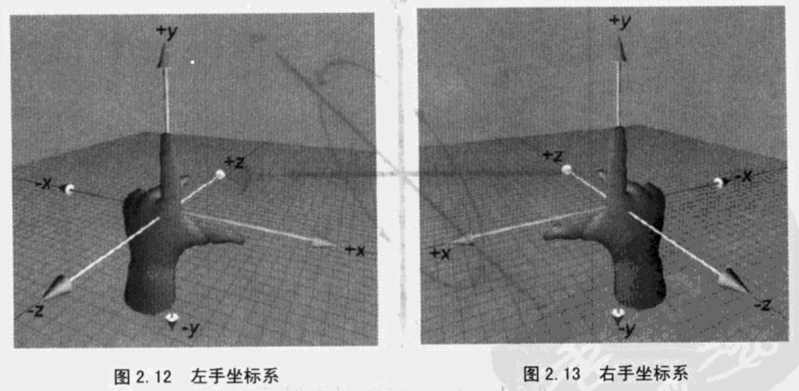
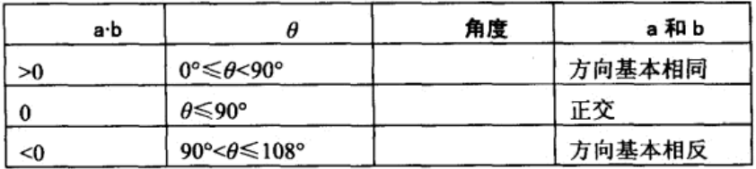
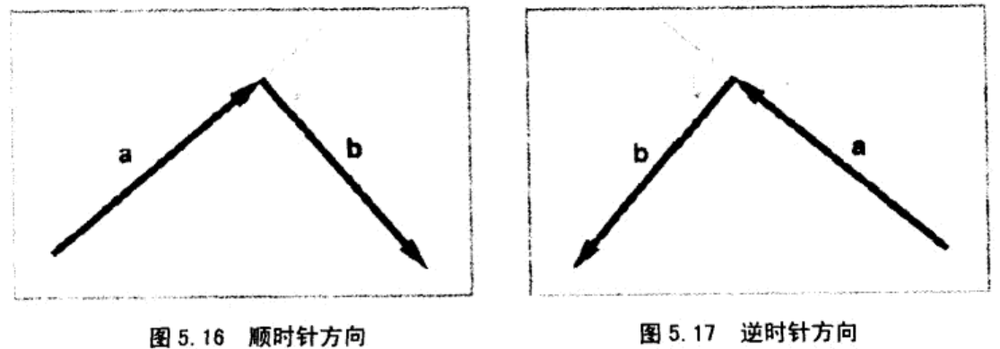

# 3D math  

> 3D数学是一门和计算几何相关的学科，计算几何是研究用数值方法解决几何问题的学科，这两门学科广泛应用于使用计算机模拟3D世界的领域，如图形学、游戏、仿真、机器人、VR、动画等。  
> ——《3D数学基础：图形与游戏开发》

- [x] [笛卡尔坐标系统](#笛卡尔坐标系统)  
- [x] [多坐标系](#多坐标系)  
- [x] [向量](#向量)  
- [x] [向量运算](#向量运算)  
- [ ] 3D向量类
- [ ] 矩阵
- [ ] 矩阵和线性变换
- [ ] 矩阵Plus（行列式、矩阵的逆、正交矩阵、4x4齐次矩阵）  
- [ ] 3D中的方位与角位移
- [ ] 几何图元  
- [ ] 几何检测  
- [ ] 三角网格
- [ ] 图形数学
- [ ] 可见性检测

## 笛卡尔坐标系统  

左右手坐标系有所不同，在研究问题时这点要注意一下，这里无特殊说明都使用**左手坐标系**  
  

## 多坐标系  

- 世界坐标系  
- 物体坐标系  
- 摄像机坐标系  
- 惯性坐标系  

每种坐标系都应该用在合适的地方，如描述物体的位置应该**世界坐标系**，检查两个物体间相对位置、是否应该有相互作用应该使用**物体坐标系**；**摄像机坐标系**是为观察者服务的，它用来控制屏幕上的显示区域；**惯性坐标系**是为了简化世界坐标系和物体坐标系之间的转化而被创建的，它的原点和物体坐标系重合，但它的轴完全平行于世界坐标系的轴  

由此引入一个很重要的概念：**嵌套坐标系**。比如要求一只羊耳朵在空间中的运动轨迹。我们假设它只会上下摆动，这轨迹仅用世界坐标系也难以描述，我们可以从羊的运动带动头再带动耳朵去分析，羊的运动相对于世界坐标系很容易就能得出运动轨迹，羊头和羊的运动除了y轴不一样外几乎是一致的，耳朵也是如此，和羊头一致，这样耳朵相对于羊头，羊头相对于羊，羊相对于世界的运动可以通过**线性变换**计算出来，“相对于”说的就是子坐标系相对于父坐标系  

**描述坐标系**就是描述坐标系的位置和方向。坐标系的位置指原点的位置，这里指的是其在父坐标系中的位置，坐标系方向指轴的方向，用向量表示，这点比较复杂，以后再说  

在世界中，物体之间的交互要通过**坐标变换**完成。它可以这么解释：知道某一点的坐标，怎样在另一个坐标系中描述该点。我们知道可以使用**惯性坐标系**这个媒介，用**旋转**可以从物体坐标系转换到惯性坐标系，用**平移**可以从惯性坐标系转换到世界坐标系  

## 向量  

“点”描述位置，“向量”描述位移和相对位置，向量[x, y]描述了原点到点(x, y)的位移量  
思考位置时，想像一个点，思考位移时，想像一个向量和一个箭头  

## 向量运算  

**负向量(各分量取负)**：
$\vec v+(-\vec v)=0$
，几何上表示与原点的连线方向相反  

**向量的模**：
$||\vec v||=\sqrt{v_1^2+v_2^2+...+v_{n-1}^2+v_n^2}$  

**标量与向量可以相乘**：  

$$
k\begin{bmatrix} x \\ y \\ z \end{bmatrix}=\begin{bmatrix} x \\ y \\ z
\end{bmatrix}k=\begin{bmatrix} kx \\ ky \\ kz \end{bmatrix}
$$  

几何意义上标量与向量相乘是对向量进行缩放以及翻转操作，拉伸、缩短、反转方向（各分量取负值）  

**标准化向量**：很多时候我们只关心向量的方向而不在乎其大小，那么使用**单位向量**更加方便，单位向量就是大小为1的向量，它也经常被简单的称为**标准化向量**或更简单地称为**法线**  

**向量标准化：向量除以它的模**  
$\vec v_{norm}=\dfrac{\vec v}{||\vec v||}$  

两个**维数相同**的向量可以相加/相减：各分量相加减  

$$
\begin{bmatrix} x_1 \\ y_1 \\ z_1 \end{bmatrix}
+
\begin{bmatrix} x_2 \\ y_2 \\ z_2 \end{bmatrix}
=
\begin{bmatrix} x_1+x_2 \\ y_1+y_2 \\ z_1+z_2\end{bmatrix}
$$  

向量相减解释为一个向量加上另一个向量的负向量：
$\vec v_1-\vec v_2=\vec v_1+(-\vec v_2)$  
向量加法满足交换律，减法不满足交换律，因为
$\vec a-\vec b=-(\vec b-\vec a)$
这两个向量的方向是相反的  

向量加减法的三角形法则：
$\vec a+\vec b=\vec b+\vec a$
是一条b尾平移至a头，然后a尾指向b头的向量；
$a-b$
是一条b尾平移至a尾，然后b头指向a头的向量  

**两点之间的位移**是非常普遍的需求，利用三角形法则就能很容易解出来，只要把原点到两点的直线段当做两个向量，然后相减就可以了

**距离公式**：计算两点之间的距离  
我们可以先用减法得到两点间的位移向量，然后取模就能得到距离大小，由此得到两点间的距离公式为  
$(\vec a, \vec b)=||\vec b-\vec a||=\sqrt{(b_x-a_x)^2+(b_y-a_y)^2+(b_z-a_z)^2}$  

**向量点乘**：对应分量乘积的和，结果是一个标量，点乘满足交换律  

$$
\vec a\cdot\vec b
=
\begin{bmatrix} a_1 \\ a_2 \\ a_3 \end{bmatrix}
\cdot
\begin{bmatrix} b_1 \\ b_2 \\ b_3 \end{bmatrix}
=
\begin{bmatrix} a_1b_1 \\ a_2b_2 \\ a_3b_3 \end{bmatrix} 
=
\sum\limits_{i=1}^{n}a_ib_i
$$  

点乘描述了两个向量的**相似程度**，点乘结果越大，向量越相近  
点乘也等于向量大小和向量夹角cos的积：
$\vec a·\vec b=||\vec a||\ ||\vec b||\ cos\theta$  
从中可以解出：
$\theta=\arccos{(\dfrac{\vec a\cdot\vec b}{||\vec a||\ ||\vec b||})}$  

根据点乘结果也可以大致判断向量的方向  
  

**向量投影**：给定两个向量 $\vec v$ 和 $\vec n$ ，能将 $\vec v$ 分解成两个分量 $\vec v_\parallel$ 和 $\vec v_\perp$，他俩一个平行于 $\vec n$，一个垂直于 $\vec n$，一般称平行分量 $\vec v_\parallel$ 为 $\vec v$ 在 $\vec n$ 上的投影  
根据上面的点乘公式可以求出：
$\vec v_\parallel=\vec n\dfrac{\vec v\cdot\vec n}{||\vec n||^2}$  
根据公式 $\vec v_\parallel+\vec v_\perp=\vec v$，可知：
$\vec v_\perp=\vec v-\vec v_\parallel=\vec v-\vec n\dfrac{\vec v·\vec n}{||\vec n||^2}$  

**向量叉乘：**

$$
\begin{bmatrix} x_1 \\ y_1 \\ z_1 \end{bmatrix}
\times
\begin{bmatrix} x_2 \\ y_2 \\ z_2 \end{bmatrix}
=
\begin{bmatrix} y_1z_2-z_1y_2 \\ z_1x_2-x_1z_2 \\ x_1y_2-y_1x_2 \end{bmatrix}
$$  
它的结果是一个向量，它垂直于原来的两个向量  

叉乘不满足交换律，满足反交换律：
$\mathbf{a}\times\mathbf{b}=-(\mathbf{b}\times\mathbf{a})$，和点乘在一起运算时优先运算叉乘（三重积：
$\mathbf{a}\cdot\mathbf{b}\times\mathbf{c}$ 是个标量）  
它的长度为：
$||\mathbf{a}\times\mathbf{b}||=||\mathbf{a}||\ ||\mathbf{b}||\sin\theta$  
叉乘的长度与向量夹角的sin值有关，这个长度也是a为边b为底的平行四边形的面积  
叉乘得到的向量方向判断（计算机倒是不需要这样），将向量 $\mathbf{a}\times\mathbf{b}$ 如下图相连  
  
在[左手坐标系](#笛卡尔坐标系统)中如果是顺时针方向，那么叉乘结果指向自己，如果是逆时针方向那么远离自己  
在右手坐标系中则相反  

注：点乘尾-尾相连求夹角，叉乘头-尾相连求方向  
