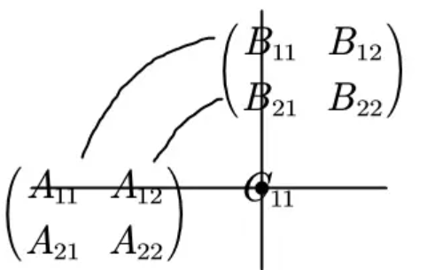

# 3D math  

> 3D数学是一门和计算几何相关的学科，计算几何是研究用数值方法解决几何问题的学科，这两门学科广泛应用于使用计算机模拟3D世界的领域，如图形学、游戏、仿真、机器人、VR、动画等。  
> ——《3D数学基础：图形与游戏开发》

- [x] [笛卡尔坐标系统](#笛卡尔坐标系统)  
- [x] [多坐标系](#多坐标系)  
- [x] [向量](#向量)  
- [x] [向量运算](#向量运算)  
- [x] [3D向量类](#3d向量类)
- [x] [矩阵](#矩阵)
- [ ] 矩阵和线性变换
- [ ] 矩阵Plus（行列式、矩阵的逆、正交矩阵、4x4齐次矩阵）  
- [ ] 3D中的方位与角位移
- [ ] 几何图元  
- [ ] 几何检测  
- [ ] 三角网格
- [ ] 图形数学
- [ ] 可见性检测

## 笛卡尔坐标系统  

左右手坐标系有所不同，在研究问题时这点要注意一下，这里无特殊说明都使用**左手坐标系**  
  

## 多坐标系  

- 世界坐标系  
- 物体坐标系  
- 摄像机坐标系  
- 惯性坐标系  

每种坐标系都应该用在合适的地方，如描述物体的位置应该**世界坐标系**，检查两个物体间相对位置、是否应该有相互作用应该使用**物体坐标系**；**摄像机坐标系**是为观察者服务的，它用来控制屏幕上的显示区域；**惯性坐标系**是为了简化世界坐标系和物体坐标系之间的转化而被创建的，它的原点和物体坐标系重合，但它的轴完全平行于世界坐标系的轴  

由此引入一个很重要的概念：**嵌套坐标系**。比如要求一只羊耳朵在空间中的运动轨迹。我们假设它只会上下摆动，这轨迹仅用世界坐标系也难以描述，我们可以从羊的运动带动头再带动耳朵去分析，羊的运动相对于世界坐标系很容易就能得出运动轨迹，羊头和羊的运动除了y轴不一样外几乎是一致的，耳朵也是如此，和羊头一致，这样耳朵相对于羊头，羊头相对于羊，羊相对于世界的运动可以通过**线性变换**计算出来，“相对于”说的就是子坐标系相对于父坐标系  

**描述坐标系**就是描述坐标系的位置和方向。坐标系的位置指原点的位置，这里指的是其在父坐标系中的位置，坐标系方向指轴的方向，用向量表示，这点比较复杂，以后再说  

在世界中，物体之间的交互要通过**坐标变换**完成。它可以这么解释：知道某一点的坐标，怎样在另一个坐标系中描述该点。我们知道可以使用**惯性坐标系**这个媒介，用**旋转**可以从物体坐标系转换到惯性坐标系，用**平移**可以从惯性坐标系转换到世界坐标系  

## 向量  

“点”描述位置，“向量”描述位移和相对位置，它同时包含了方向和数量大小，向量 $[x,y]$ 描述了原点到点 $(x, y)$ 的位移量  
思考位置时，想像一个点，思考位移时，想像一个向量和一个箭头  

## 向量运算  

**负向量(各分量取负)**：
$\vec v+(-\vec v)=0$
，几何上表示与原点的连线方向相反  

**向量的模**：
$||\vec v||=\sqrt{v_1^2+v_2^2+...+v_{n-1}^2+v_n^2}$  

**标量与向量可以相乘**：  

$$
k\begin{bmatrix}
  x \\
  y \\
  z
\end{bmatrix}=
\begin{bmatrix}
  x \\
  y \\
  z
\end{bmatrix}k=
\begin{bmatrix}
  kx \\
  ky \\
  kz
\end{bmatrix}
$$  

几何意义上标量与向量相乘是对向量进行缩放以及翻转操作，拉伸、缩短、反转方向（各分量取负值）  

**标准化向量**：很多时候我们只关心向量的方向而不在乎其大小，那么使用**单位向量**更加方便，单位向量就是大小为1的向量，它也经常被简单的称为**标准化向量**或更简单地称为**法线**  

**向量标准化：向量除以它的模**  
$\vec v_{norm}=\dfrac{\vec v}{||\vec v||}$  

两个**维数相同**的向量可以相加/相减：各分量相加减  

$$
\begin{bmatrix}
  x_1 \\
  y_1 \\
  z_1
\end{bmatrix}+
\begin{bmatrix}
  x_2 \\
  y_2 \\
  z_2
\end{bmatrix}=
\begin{bmatrix}
  x_1+x_2 \\
  y_1+y_2 \\
  z_1+z_2
\end{bmatrix}
$$  

向量相减解释为一个向量加上另一个向量的负向量：
$\vec v_1-\vec v_2=\vec v_1+(-\vec v_2)$  
向量加法满足交换律，减法不满足交换律，因为
$\vec a-\vec b=-(\vec b-\vec a)$
这两个向量的方向是相反的  

向量加减法的三角形法则：
$\vec a+\vec b$
是一条b尾平移至a头，然后a尾指向b头的向量；
$\vec a-\vec b$
是一条b尾平移至a尾，然后b头指向a头的向量  

**两点之间的位移**是非常普遍的需求，利用三角形法则就能很容易解出来，只要把原点到两点的直线段当做两个向量，然后相减就可以了

**距离公式**：计算两点之间的距离  
我们可以先用减法得到两点间的位移向量，然后取模就能得到距离大小，由此得到两点间的距离公式为  
$(\vec a, \vec b)=||\vec b-\vec a||=\sqrt{(b_x-a_x)^2+(b_y-a_y)^2+(b_z-a_z)^2}$  

**向量点乘**：对应分量乘积的和，结果是一个标量，点乘满足交换律  

$$
\vec a\cdot\vec b=
\begin{bmatrix}
  a_1 \\
  a_2 \\
  a_3
\end{bmatrix}\cdot
\begin{bmatrix}
  b_1 \\
  b_2 \\
  b_3
\end{bmatrix}=
\begin{bmatrix}
  a_1b_1 \\
  a_2b_2 \\
  a_3b_3
\end{bmatrix}=
\sum\limits_{i=1}^{n}a_ib_i
$$  

点乘描述了两个向量的**相似程度**，点乘结果越大，向量越相近  
点乘也等于向量大小和向量夹角cos的积：
$\vec a·\vec b=||\vec a||\ ||\vec b||\ cos\theta$  
从中可以解出：
$\theta=\arccos{(\dfrac{\vec a\cdot\vec b}{||\vec a||\ ||\vec b||})}$  

根据点乘结果也可以大致判断向量的方向  
  

**向量投影**：给定两个向量 $\vec v$ 和 $\vec n$ ，能将 $\vec v$ 分解成两个分量 $\vec v_\parallel$ 和 $\vec v_\perp$，他俩一个平行于 $\vec n$，一个垂直于 $\vec n$，一般称平行分量 $\vec v_\parallel$ 为 $\vec v$ 在 $\vec n$ 上的投影  
根据上面的点乘公式可以求出：
$\vec v_\parallel=\vec n\dfrac{\vec v\cdot\vec n}{||\vec n||^2}$  
根据公式 $\vec v_\parallel+\vec v_\perp=\vec v$，可知：
$\vec v_\perp=\vec v-\vec v_\parallel=\vec v-\vec n\dfrac{\vec v·\vec n}{||\vec n||^2}$  

**向量叉乘：**

$$
\begin{bmatrix}
  x_1 \\
  y_1 \\
  z_1
\end{bmatrix}\times
\begin{bmatrix}
  x_2 \\
  y_2 \\
  z_2
\end{bmatrix}=
\begin{bmatrix}
  y_1z_2-z_1y_2 \\
  z_1x_2-x_1z_2 \\
  x_1y_2-y_1x_2
\end{bmatrix}
$$  

它的结果是一个向量，它垂直于原来的两个向量  

叉乘不满足交换律，满足反交换律：
$\mathbf{a}\times\mathbf{b}=-(\mathbf{b}\times\mathbf{a})$，和点乘在一起运算时优先运算叉乘（三重积：
$\mathbf{a}\cdot\mathbf{b}\times\mathbf{c}$ 是个标量）  
它的长度为：
$||\mathbf{a}\times\mathbf{b}||=||\mathbf{a}||\ ||\mathbf{b}||\sin\theta$  
叉乘的长度与向量夹角的sin值有关，这个长度的数量大小也是**a为边b为底的平行四边形的面积，$||a||\sin\theta$为平行四边形的高**  
叉乘得到的向量方向判断（计算机倒是不需要这样），将向量 $\mathbf{a}\times\mathbf{b}$ 如下图相连  
  
在[左手坐标系](#笛卡尔坐标系统)中如果是顺时针方向，那么叉乘结果指向自己，如果是逆时针方向那么远离自己  
在右手坐标系中则相反  

注：点乘尾-尾相连求夹角，叉乘头-尾相连求方向  

## 3D向量类  

3D向量存储着xyz分量，3D向量类所需要的基本操作有  

- 存取向量的各个分量(xyz)  
- 向量间的赋值操作  
- 比较两向量是否相同  

我们也应该支持基本的向量运算  

- 将向量置为零向量  
- 向量求负  
- 求向量的模  
- 向量与标量的乘除法  
- 向量标准化  
- 向量加减法  
- 计算两点（用向量表示）间的距离  
- 向量点乘  
- 向量叉乘  

## 矩阵  

矩阵是重要的基础，它通过定义一种运算而将一个坐标系中的向量转换到另一个坐标系中  

m行n列的矩阵记作 $m \times n$ 矩阵，一般用一个大写字母记一个矩阵，比如：矩阵 **$M$**  

行数和列数相同的矩阵称作**方阵**，下面主要讨论 $2\times2、3\times3、4\times4$ 方阵  

所有的非对角元素都为0的**方阵**叫做**对角矩阵**  

**单位矩阵**是主对角元素都为1，其余元素都为0的矩阵，它是矩阵的**乘法单位元**，n维单位矩阵记作$I_n$  

在混用矩阵和向量的时候要特别注意**向量是行向量还是列向量**，毕竟向量本身用一行或者一列的方式表示并没有本质上的不同  

**矩阵转置**：  

$r \times c$ 矩阵 $M$，它的转置矩阵为 **$M^r$**，是一个 $c \times r$ 矩阵  

矩阵转置会使行变成列，列变成行，对于方阵和沿着主对角线翻折得到的矩阵相同  

- 行向量 <--转置--> 列向量  
- 书面中的列向量通常记作 $[a, b, c]^r$  
- 任意矩阵 $M=(M^r)^r$，矩阵转置的转置为原矩阵，也适用于向量
- 任意对角矩阵$D$，$D^r=D$

**标量和矩阵的乘法**：  

$kM$即$k$和矩阵$M$中的每一个元素相乘  

**矩阵乘法**：

一个$r \times n$矩阵$A$能和一个$n \times c$矩阵$B$相乘，记作$AB$，它是一个$r \times c$矩阵，$A$的列数和$B$的行数必须相等  

$\vec c_{ij} =\sum\limits_{k=1}^{n}a_{ik}b_{kj}$  
矩阵a中每一行与b中每一列的乘积之和能得到c中一个元素（相应行列向量的点积），位置是一一对应的  

  

- $I$是单位矩阵，那么$MI=IM=M$  
- 矩阵乘法不满足交换律，$AB \neq BA$  
- 矩阵乘法满足结合律，$ABC = A(BC)$，这里有个矩阵链问题，即寻找标量乘法最少的括号问题  
- 矩阵乘法满足标量或向量的结合律，$(kA)B=k(AB)=A(kB)$，$vAB=v(AB)$  
- **矩阵积的转置等于先转置矩阵再相乘**，$(AB)^r=B^rA^r$，这个同样可以扩展到多个矩阵的情况  

注意：矩阵乘法一定要有意义上面说的才能成立，有意义即两个矩阵能够相乘  

**向量与矩阵的乘法**：

向量可以作为一行n列的矩阵或者一列n行的矩阵，运算同样满足矩阵乘法  

- 行向量左乘矩阵得到行向量，列向量右乘矩阵得到列向量，方向不能换  
- 结果向量中的每个元素都是原向量与矩阵中单独行或列的点积  
- 矩阵中的每个元素都决定了向量中特定元素在输出向量中的比重  
- 矩阵和向量的乘法满足对向量加法的分配率，$(v+w)M=vM+wM$  

**行向量与列向量**：  

行向量/列向量和$M$的乘积为  

$$
[xm_{11}+ym_{21}+zm_{31}, xm_{12}+ym_{22}+zm_{32}, xm_{13}+ym_{23}+zm_{33}]
$$  

$$
\begin{bmatrix}
  xm_{11}+ym_{12}+zm_{13} \\
  xm_{21}+ym_{22}+zm_{23} \\
  xm_{31}+ym_{32}+zm_{33}
\end{bmatrix}
$$

这两个结果中各分量的值完全不同，这就是行向量和列向量区别如此重要的原因  

用矩阵乘法转换坐标系的时候，使用行向量是非常直观的，转换从左往右依次发生，而且，DirectX使用的是行向量  

而使用列向量稍微有点别扭，从右往左发生转换，很多图形学的书里面用的都是列向量，OpenGL用的也是列向量  

所以**在看资料或者开源代码的时候，一定要区分它们使用的是行向量还是列向量**  

3D数学编程中，形式转换经常会出错，后面会设计矩阵类，会好一点，这方面还是要多多注意啊  

### 矩阵-几何解释  

一般而言，方阵能描述任意的线性变换，线性变换保留直线的同时，其他的几何性质可能都会发生改变（长度、角度、面积和体积），直观点说，线性变换可能“拉伸”坐标系，但不会“弯曲”或“卷曲”坐标系，下面是一组非常有用的变换  

- 旋转  
- 缩放  
- 投影  
- 镜像  
- 仿射  

这里有点图形学的味道了  

**矩阵变换向量**：

把矩阵的行为解释为坐标系的基向量，那么乘以该矩阵就相当于执行了一次坐标转换，若有$aM=b$，我们就可以说$M$将$a$转换到了$b$  

从这一点上看，术语“转换”和“乘法”是等价的  

$$
v=
\begin{bmatrix}
  x \\
  y \\
  z
\end{bmatrix}=
x
\begin{bmatrix}
  1 \\
  0 \\
  0
\end{bmatrix}+
y
\begin{bmatrix}
  0 \\
  1 \\
  0
\end{bmatrix}+
z
\begin{bmatrix}
  0 \\
  0 \\
  1
\end{bmatrix}=
xp+yq+zr
$$

$p,q,r$作为基向量，$v$被表示为它们的线性变换，以$p,q,r$为行构建矩阵$M$，实际上任意三个线性无关的向量都能作为基向量  

> 线性相关和线性无关是线性代数中的概念。一组向量被称为线性相关，当且仅当其中至少有一个向量可以表示为其他向量的线性组合。换句话说，如果存在一组不全为零的系数，使得这些系数与对应的向量相乘再相加等于零向量，那么这组向量就是线性相关的。  
> 相反，如果一组向量中没有任何一个向量可以表示为其他向量的线性组合，那么这组向量就被称为线性无关。也就是说，只有当所有系数都为零时，这些系数与对应的向量相乘再相加才能等于零向量。  
> 举个例子，设有两个向量 v 和 w。如果存在一个标量 k 使得 v=kw，那么这两个向量就是线性相关的。否则，它们就是线性无关的。

**矩阵的形式**：

看看前面用到的基向量乘以任意矩阵的效果  

$$
[1\ 0\ 0]
\begin{bmatrix}
  m_{11}\ m_{12}\ m_{13} \\
  m_{21}\ m_{22}\ m_{23} \\
  m_{31}\ m_{32}\ m_{33}
\end{bmatrix}=
[m_{11}\ m_{12}\ m_{13}]
$$  

$$
[1\ 2\ 0]
\begin{bmatrix}
  m_{11}\ m_{12}\ m_{13} \\
  m_{21}\ m_{22}\ m_{23} \\
  m_{31}\ m_{32}\ m_{33}
\end{bmatrix}=
[m_{21}\ m_{22}\ m_{23}]
$$  

$$
[1\ 0\ 0]
\begin{bmatrix}
  m_{11}\ m_{12}\ m_{13} \\
  m_{21}\ m_{22}\ m_{23} \\
  m_{31}\ m_{32}\ m_{33}
\end{bmatrix}=
[m_{31}\ m_{32}\ m_{33}]
$$  

**矩阵的每一行都能解释为转换后的基向量**，这个概念有两条重要性质  

- 有了一种简单的方法形象化解释矩阵所代表的的变换  
- 有了反向建立矩阵的可能--给出一个期望的变换（旋转、缩放等等），能够构造一个变换矩阵代表次变换  

可以通过想象变换后的坐标系的基向量来想象矩阵。这些基向量在 2D 中构成“L”型，在3D中构成“三角架”型。用一个盒子及辅助物更有助于理解。  
